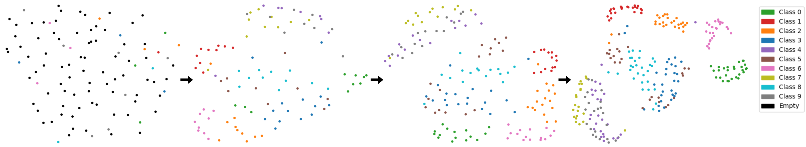
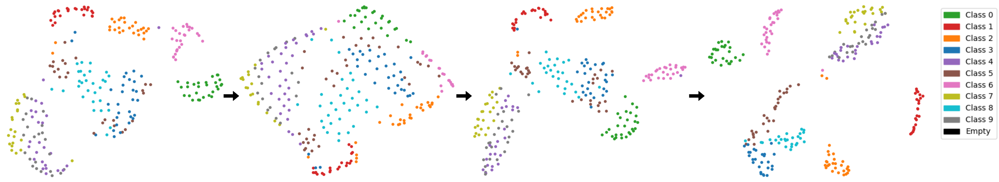
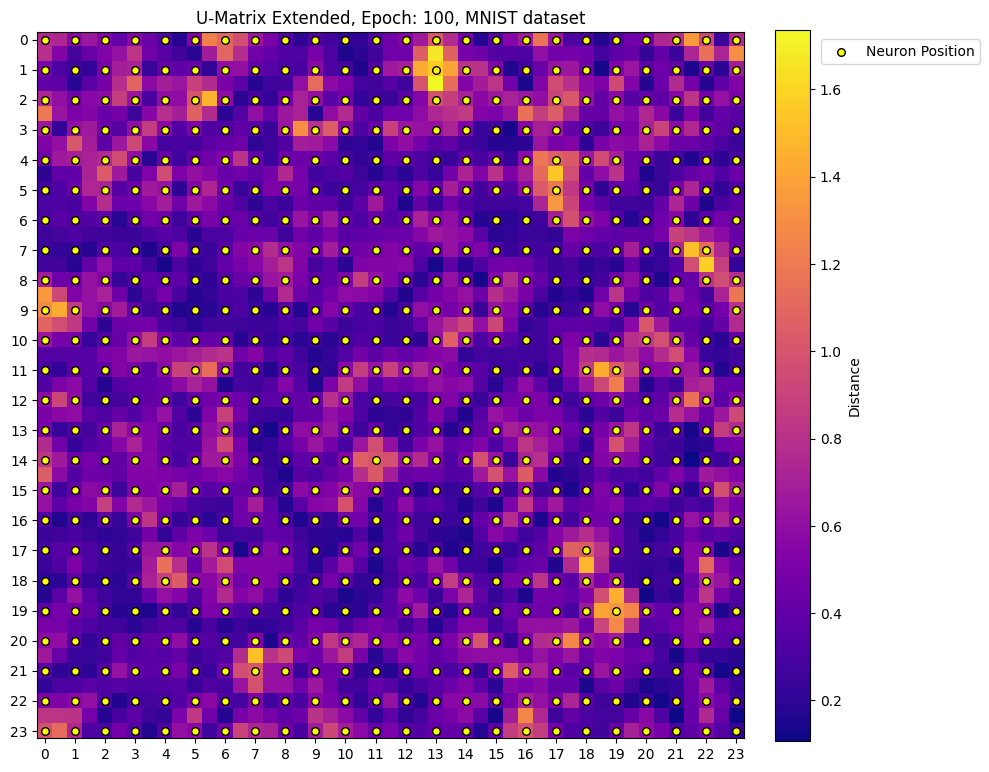
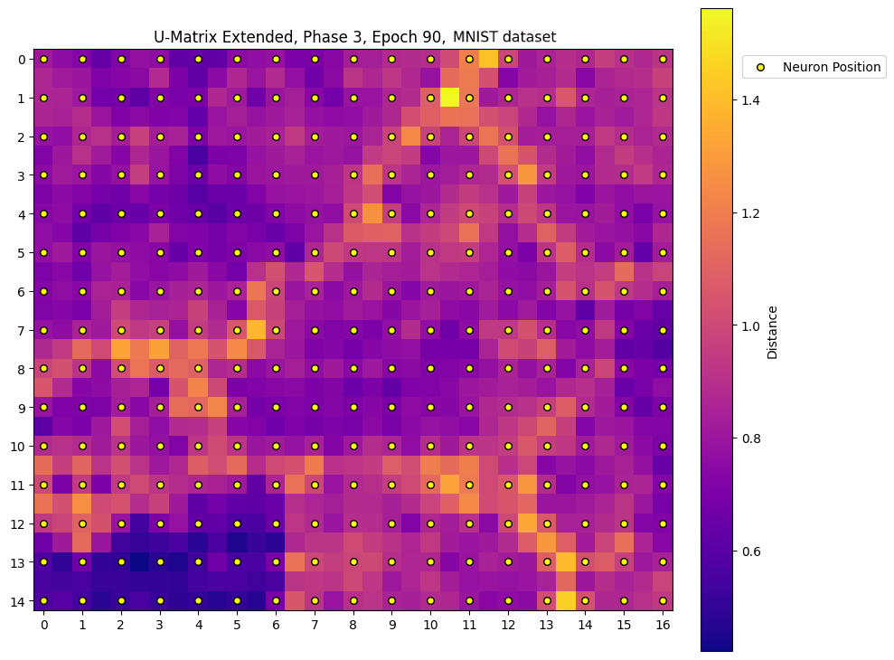
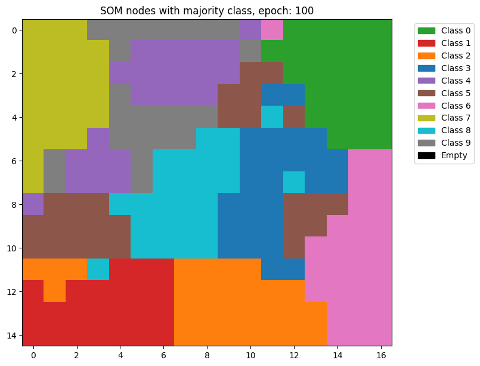
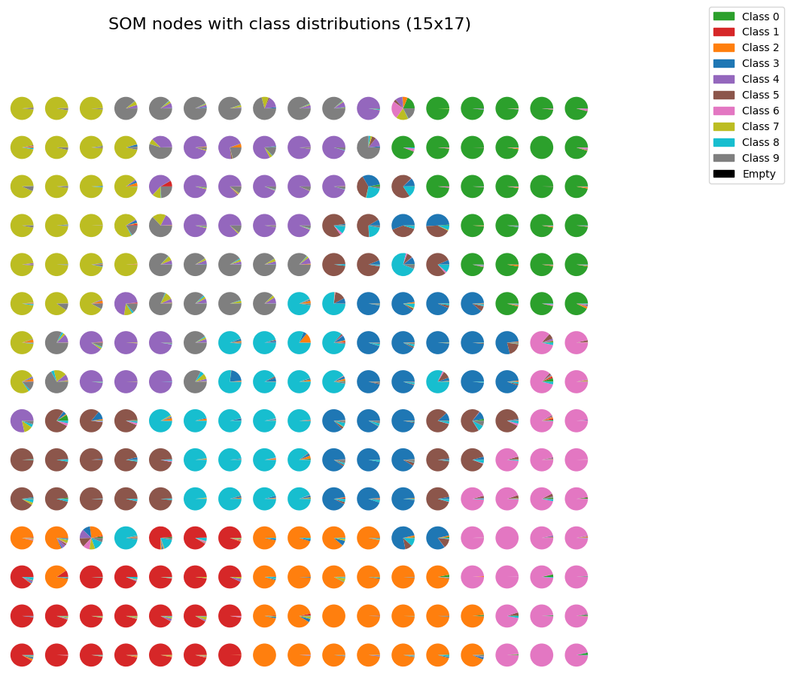
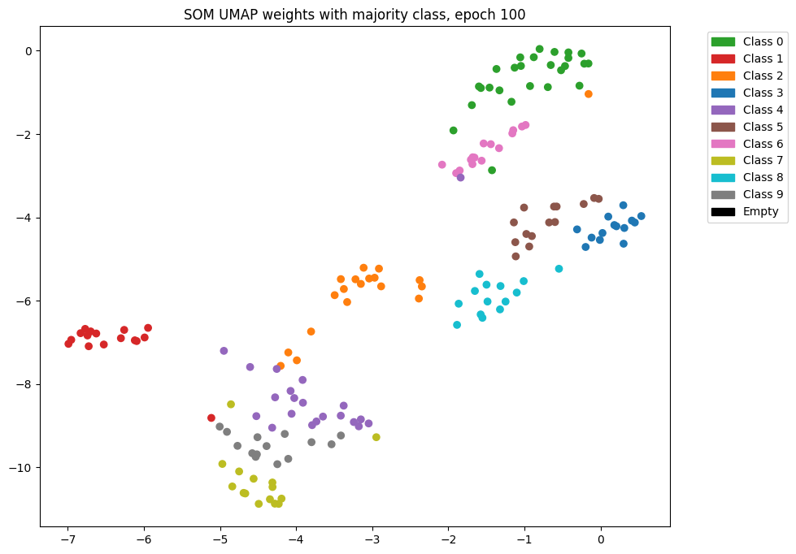
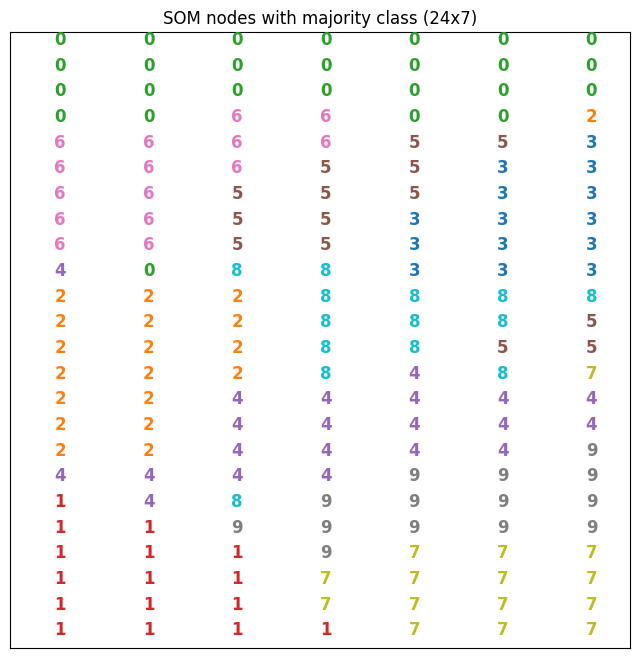

# ViT-GSOM: Vision Transformer with Adaptive Topology Learning of Growing Self-Organizing Map

[](https://opensource.org/licenses/MIT)
[](https://www.python.org/downloads/release/python-3120/)
[](https://pytorch.org/)

Official implementation of the paper **"ViT-GSOM: Vision Transformer with Adaptive Topology Learning of Growing Self-Organizing Map"**. This repository introduces a 3-phase training pipeline that combines the high-dimensional representation power of Vision Transformers (ViT) with the dynamic topological growth of Growing Self-Organizing Maps (GSOM).

---

## 1. Project Structure
* **`src/models/`**: Implementation of the ViT Encoder/Decoder and the `ViTGSOM` class.
* **`src/engine/`**: The `ViTGSOMTrainer` class which handles the 3-phase logic.
* **`src/losses/`**: Custom `SomLoss` and `ViTLoss` loss objectives.
* **`src/utils/`**: Helper functions for grid coordinates, metrics (QE, TE, Purity), and decay functions.
* **`data/`**: Data loading scripts.
* **`examples/`**: Jupyter Notebooks for demonstrations of the growth process.
* **`main.py`**: The primary CLI entry point for training and evaluation.

---

## 2. Installation

1. **Clone the repository:**
   ```bash
   git clone https://github.com/hanzltom/ViT-GSOM.git
   cd ViT-GSOM
    ```
   
2. **Create and activate a virtual environment:**
    ```bash
    python3 -m venv venv
    source venv/bin/activate
    ```
   
3. **Install dependencies:**
    ```bash
   pip install -r requirements.txt
    ```

---

## 3. The 3-phase Training Pipeline

The training of ViT-GSOM is divided into three sequential phases:
1. **Phase 1: ViT Pre-Training**: The ViT encoder and decoder are trained to reconstruct input images and to learn a stable latent representation. The SOM weights are frozen.
2. **Phase 2: SOM Growth**: The SOM weights are unfrozen and enabled to grow, while the ViT is frozen. The training process dynamically inserts new rows and columns of neurons to the grid into areas with high Quantization error to increase the level of detail in this region. The growth ends once the *Stop Growth Purity* is reached.
3. **Phase 3: SOM Fine-Tuning** A fine-tuning phase to maximize purity where the SOM grid size is locked and the ViT weights remain frozen. 

---
## 4. Usage 
You can run the full pipeline using ``main.py``. The script automatically handles data downloading to ``data/datasets/``.

```bash
# Train on MNIST (28x28)
python main.py --dataset mnist

# Train on USPS (16x16)
python main.py --dataset usps
 ```

**Examples**:
For the grid growth and latent space clustering examples, refer to the notebooks in the ``examples/`` folder

---

## 4. Results (Benchmarks)

| Dataset | Method | Final Grid Size (Nodes)  | Target Purity Threshold | Final Purity |
| :--- | :--- | :--- | :--- |:-------------|
| **MNIST** | ViT-SOM | 576 (24x24) | -- | 0.933        |
| | **ViT-GSOM (ours)** | **255 (15x17)** | 0.900 | **0.924**    |
| --- | --- | --- | --- | ---          |
| **Fashion-MNIST** | ViT-SOM | 576 (24x24) | -- | 0.809        |
| | **ViT-GSOM (ours)** | **500 (20x25)** | 0.800 | **0.808**    |
| --- | --- | --- | --- | ---          |
| **USPS** | ViT-SOM | 576 (24x24) | -- | 0.935        |
| | **ViT-GSOM (ours)** | **320 (32x10)** | 0.900 | **0.938**    |

---

## 5. Visualizations
### Latent Space Projection (UMAP) for MNIST dataset
Phase 2:<br>



Phase 3:<br>


### U-Matrix baseline comparison for MNIST dataset
ViT-SOM baseline:<br>


ViT-GSOM:<br>


The dynamic topological training results in a more descriptive U-Matrix and better separated clusters in the latent space compared to the static baseline. The cluster separation on this U-Matrix is visualized in the following grid using a majority class mapping:



### Internal class distributions for MNIST dataset



### UMAP)for USPS dataset

End of Phase 3:<br>


Corresponding majority class grid mapping:




---

# 6. Citation

TBA